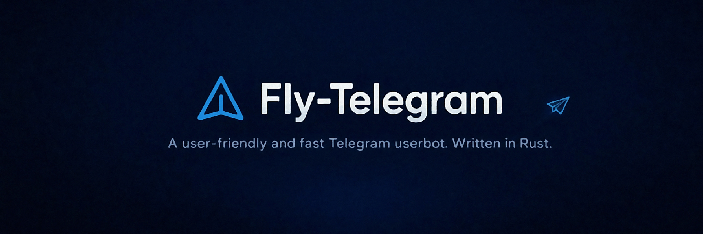

# ✈️ fly-telegram



[](https://github.com/BadPrivacyclub/rust-fly-telegram/actions/workflows/ci.yml)
[](LICENSE)

A fast Telegram userbot written in Rust, with hot-reloaded Lua modules, a local web
panel, and a control bot inside Telegram. One executable, no runtime dependencies.

- **27 built-in modules**: notes, reminders, keyword auto-replies, AI (OpenAI, Anthropic,
  Gemini), group moderation, PM guard, anti-delete, weather, currency, QR codes, a calculator,
  backups, and more. Each module documents itself in `.help`.
- **Account tools**: smart cleanup (contacts, groups, channels, chats, with a preview and an
  export first), read all, archive, mute, profile, across one or several accounts.
- **Automations**: scheduled messages, away replies, forwarding, auto-delete, a clock in
  your name or bio, bio rotation, always-online.
- **Web panel** at `http://127.0.0.1:8080`: a first-run setup wizard, an activity overview,
  accounts with bulk actions, an automation editor, background tasks, module management
  with settings forms, live logs, the deleted-message archive, backups, and settings.
  It offers 12 color themes and visual effects, has a Ctrl+K command palette, and works
  in English and Russian.
- **Control bot**: a menu in Telegram with status, modules, settings, and errors, plus
  notifications. New private messages arrive with **Allow** and **Block** buttons.
- **Build and run**: compile from source, start the program, and the setup wizard opens
  in your browser. A background service with one command, and updates by `git pull`.
- **Safe by default**: the panel only accepts local connections and requires a login.
  Third-party modules run in a sandbox until you grant permissions. A master password
  encrypts your data on disk.

---

## Quick start

### 1. Build it yourself (recommended)

Build fly-telegram from source on your own machine. A userbot holds a full Telegram
session, so run only code you can read and compiled yourself. No prebuilt binaries are
published, and we recommend that everyone builds from source.

Requirements: stable [Rust](https://rustup.rs), a C compiler (Lua 5.4 and SQLite are
compiled in), and Git.

```bash
git clone https://github.com/BadPrivacyclub/rust-fly-telegram.git
cd rust-fly-telegram
cargo build --release        # or ./compile.sh / compile.bat
./target/release/fly-telegram
```

Data is kept next to the executable (or in `~/fly-telegram` when the executable sits in a
system folder), and the setup wizard opens in your browser.

The `install.sh` and `install.ps1` scripts only exist for convenience. They download a
release archive if one exists and otherwise build from source. Prefer the build above and
review the scripts before running anything piped from the internet.

### 2. Run and open the wizard

```bash
fly-telegram --data-dir ~/fly-telegram
```

Open **http://127.0.0.1:8080**. The wizard asks for:

1. A **panel password**, to protect the web panel.
2. An optional **control bot** token from [@BotFather](https://t.me/BotFather).
3. Your **Telegram API keys** from [my.telegram.org/apps](https://my.telegram.org/apps).
4. Your **phone number**, the login code, and your 2FA password if you use one.

After you sign in, the panel opens automatically.

### 3. Try it

Send `.help` in any Telegram chat (Saved Messages works well).

---

## Commands

All commands use your prefix (`.` by default; change it with `.prefix`). They respond
only to your own messages, and to [sudo users](#sudo-users) for safe commands. Run
`.help <module>` or `.help <command>` for details.

| Area | Commands |
|---|---|
| Core | `.help`, `.ping`, `.stats`, `.restart`, `.update`, `.eval`, `.term` |
| Settings | `.prefix`, `.lang`, `.modules`, `.module`, `.cfg`, `.sudo`, `.panel` |
| Account | `.acc`, `.cleanup`, `.readall`, `.archive`, `.muteall`, `.export`, `.jobs`, `.profile` |
| Automation rules | `.auto`, `.away` |
| Backups | `.backup`, `.restore` |
| Messaging | `.note`, `.notes`, `.alias` |
| Automation | `.remind`, `.later`, `.filter`, `.unfilter`, `.filters`, `.afk`, `.autoread`, `.antidelete`, `.gifts`, `.taskbot` |
| Security | `.pmguard`, `.approve`, `.block` |
| Groups | `.welcome`, `.purge`, `.pin`, `.unpin`, `.tagall`, `.cleanjoins`, `.captcha` |
| Info | `.info`, `.ip`, `.domain`, `.rdap`, `.del`, `.sd`, `.ytdl` |
| Utilities | `.weather`, `.cur`, `.qr`, `.calc`, `.paste`, `.time`, `.pass`, `.short`, `.b64`, `.hash`, `.uuid`, `.id` |
| Files | `.dl`, `.sendfile`, `.urlupload`, `.rename` |
| AI | `.ai`, `.ask`, `.summarize`, `.translate`, `.transcribe` |
| Modules | `.install`, `.market` |
| Music | `.play`, `.vplay`, `.queue`, `.skip`, `.seek`, `.loop`, `.shuffle`, `.stop`, `.toptracks` |
| Fun | `.type`, `.scroll`, `.magic`, `.heart`, `.coin`, `.dice`, `.random`, `.countdown` |

A few examples:

```text
.remind 2h30m call the bank      → reminder in Saved Messages, even if the bot is offline
.later 18:45 Dinner is ready!     → this chat receives the message at 18:45
.filter price | See the pinned message
.cfg ai openai_api_key sk-...     → module settings, also editable in the panel
.cur 100 usd eur   ·   .calc 2*(3+4)^2   ·   .weather Berlin
.module off animate                → disable a module without deleting it
.cleanup groups channels inactive=90   → preview leaving inactive groups and channels
.away 23:00-08:00 Sleeping 🌙        → night-time auto-reply
.auto clock name Alex {clock} {time} → live clock in your name
```

### Account cleanup

Cleanup always happens in two steps, so nothing is deleted by accident:

1. `.cleanup <what> [filters]` (or Accounts → Smart cleanup in the panel) shows exactly
   what would be removed.
2. `.cleanup run <code>` (or typing the confirmation word in the panel) starts it. A JSON
   export of everything being removed is saved to `backups/exports/` first.

What to clean: `contacts`, `groups`, `channels`, `chats`, `bots`, or `all`. Filters:
`inactive=<days>`, `keep=@user,123`, `archived` (archive only), `revoke` (delete chats
for both sides), `admins` and `pinned` (include chats that are kept by default). Groups
and channels you own are never touched. Requests are paced to avoid Telegram limits,
and the task can be cancelled from `.jobs` or the panel.

### Module settings

Modules declare their settings, so you never edit JSON by hand:

- **Telegram**: `.cfg` lists configurable modules, `.cfg ai` shows a module's settings,
  `.cfg ai provider anthropic` changes one, and `.cfg ai provider reset` restores the default.
- **Panel**: Modules → Configure opens a form generated from the same schema. Secret
  values are write-only.

### Sudo users

`.sudo add` (as a reply, or followed by a user ID) lets a trusted friend run commands
for you. Some commands stay owner-only: those that execute code, touch files, install
modules, change settings, reveal your notes and snippets, or use your AI API keys.

---

## Control bot

Create a bot with [@BotFather](https://t.me/BotFather) and add its token in the wizard or
under Settings → Control bot. Then press **Start** in your bot. It answers only the
accounts logged into your userbot.

| | |
|---|---|
| `/start` | Menu: status, modules, settings, recent errors, web panel link, language, restart |
| Notifications | Module errors, startup, new private messages (with **Allow** and **Block** buttons), deleted messages (off by default) |
| Inline help | Send `/setinline` to BotFather and `.help` turns into an interactive message with buttons |

You can switch each notification type on or off in the bot or in the panel.

---

## Web panel

The panel listens on `127.0.0.1:8080` and accepts only requests addressed to `localhost`,
`127.0.0.1`, or `[::1]`. You sign in with:

- your **panel password**, or
- a **one-time link**: one is printed in the console at startup, and `.panel` in
  Telegram sends a fresh one to Saved Messages.

| Page | What you can do |
|---|---|
| Overview | Uptime, commands, memory, a 60-minute activity chart, top commands, accounts, a getting-started checklist |
| Accounts | Select one or several accounts, live chat counts, bulk actions, the smart cleanup wizard, profile editing |
| Automations | Visual editor for all rule types, per-account targeting, enable/disable |
| Tasks | Background tasks with progress, logs, and cancel |
| Modules | Enable or disable, configure, grant permissions to sandboxed modules, view source, reload, delete, install from a URL |
| Logs | Live log stream with a level filter |
| Anti-delete | Search deleted messages and preview their media |
| Backups | Download a backup, or restore one and restart |
| Settings | Prefixes, language, sudo users, bot token, handlers, notifications, panel and master passwords, proxy, updates, restart |

To add another Telegram account, go to Accounts → **Add account**. Press **Ctrl+K**
anywhere for the command palette, and use the 🎨 button for themes, accent color, and
effects.

---

## Running in the background

```bash
fly-telegram --data-dir ~/fly-telegram service install     # systemd (Linux), launchd (macOS), Task Scheduler (Windows)
fly-telegram --data-dir ~/fly-telegram service uninstall
fly-telegram --data-dir ~/fly-telegram service print       # show the definition without installing
```

A background service cannot prompt for input. If you use a master password, put
`FLY_MASTER_PASSWORD=...` in `fly-telegram.env` inside the data directory. The installer
creates this file with private permissions.

`.restart` and the panel's Restart button restart the process in place, so they work
with or without a supervisor.

## Updating

- **Source checkout (recommended)**: `.update` runs `git pull`. If Rust code changed, it
  rebuilds and restarts.
- **Prebuilt binary** (only if you obtained one): `.update` shows what's new, and
  `.update now` downloads the new release, swaps the executable, and restarts. The panel
  offers the same under Settings → Network and updates.

Built-in modules update with the binary. Modules you edited are left alone, and
`.module restore <name>` brings back the original.

## Troubleshooting

```bash
fly-telegram --data-dir ~/fly-telegram doctor
```

`doctor` checks that the data directory is writable and the port is free, that Telegram
is reachable (a proxy is needed where Telegram is blocked), and that optional tools
(`git`, `yt-dlp`, `ffmpeg`) are installed.

---

## Configuration

Most settings live in the database and you change them from Telegram, the bot, or the panel.
Process-level options come from, highest priority first:

1. **CLI flags**
2. **Environment variables**
3. **`config.toml`** in the data directory (`fly-telegram init` writes a commented one)

| Flag | Env | Default | Meaning |
|---|---|---|---|
| `--data-dir <path>` | `FLY_DATA_DIR` | next to the executable, or `~/fly-telegram` | All data: database, sessions, modules, backups |
| `--no-browser` | | | Do not open the browser for the setup wizard |
| `--host <addr>` | `FLY_WEB_HOST` | `127.0.0.1` | Panel bind address |
| `--port <n>` | `FLY_WEB_PORT` | `8080` | Panel port |
| `--no-panel` | | | Do not start the web panel |
| `--no-web` | | | Sign in from the terminal instead of the browser wizard |
| `--config <path>` | | `config.toml` | Alternative config file |
| | `FLY_LOG` / `RUST_LOG` | `info` | Log level, e.g. `debug` or `fly_telegram=debug` |
| | `FLY_MASTER_PASSWORD` | | Unlock or enable encryption at rest |
| | `TELOXIDE_TOKEN` | | Bot token (the token saved in the panel takes precedence) |

| Command | |
|---|---|
| `fly-telegram doctor` | Environment check |
| `fly-telegram init` | Write a default `config.toml` |
| `fly-telegram service install\|uninstall\|print` | Background service |
| `fly-telegram keygen` / `sign <module.lua>` | Module signing (see below) |
| `fly-telegram --version` / `--help` | |

### Data directory layout

```text
config.toml            process settings (optional)
fly-telegram.env       secrets for the background service (optional)
database.json(.enc)    settings and module data
fly-telegram.session   default Telegram session (.enc when sealed)
sessions/              additional accounts
modules/               Lua modules (built-in ones are installed automatically)
data/                  downloads, anti-delete archive and media
backups/               backups and pre-restore copies
keys/                  module signing keys
```

---

## Security

- **Panel**: it accepts loopback host names only, which also blocks DNS-rebinding
  attacks. State-changing requests need a custom header, so other websites cannot forge
  them. Sessions use `HttpOnly`, `SameSite=Strict` cookies. Password attempts are
  rate-limited and passwords are stored as Argon2 hashes.
- **Modules**: built-in modules that are byte-identical to the copies embedded in the
  binary are trusted. Any other module runs in a Lua sandbox with no `os`, `io`, or
  `load`, and cannot read credentials, panel settings, or other modules' settings.
  Its capabilities (`network`, `telegram.read`, `telegram.history`, `telegram.media`,
  `secrets`, `shell`, `modules.install`, `core.admin`) are granted in the panel or in
  its manifest.
- **Module signing**: to give one of your own modules full trust, run
  `fly-telegram keygen` once, then `fly-telegram sign modules/my.lua`. The signature
  covers the source, name, version, and permissions.
- **Encryption at rest**: set a master password under Settings → Security. It encrypts
  the database, the default session (on shutdown), and the anti-delete archive with
  Argon2id and XChaCha20-Poly1305.
- **Backups** never include Telegram sessions or `fly-telegram.env`. A backup of an
  unencrypted database contains your API hash and bot token, and the panel warns about
  this.

Never share your `*.session` files: anyone who has one can use your account.

---

## Writing modules

```lua
local M = {}

M.commands = { hello = "hello_cmd" }

M.help = {
    category = "fun",
    description = "Says hello",
    commands = { hello = { args = "[name]", desc = "Greet someone" } },
}

M.config = {
    { key = "greeting", type = "string", default = "Hello", description = "Greeting word" },
}

function M.hello_cmd(ctx, args)
    local name = args ~= "" and args or "world"
    ctx:edit(ui.ok(ctx:cfg("greeting") .. ", " .. name .. "!"))
end

return M
```

Save it as `modules/hello.lua`. It loads immediately, shows up in `.help` and the panel,
and has a settings form. The full API, including events, the `ui` and `json` helpers,
permissions, and scheduling, is in **[moduleBuild.md](moduleBuild.md)**.

---

## Building from source

See [Quick start](#1-build-it-yourself-recommended) for the build steps.

Run the checks that CI runs:

```bash
cargo fmt --check && cargo clippy --all-targets -- -D warnings && cargo test
```

## Project structure

| Path | Contents |
|---|---|
| `src/main.rs` | Entry point and CLI |
| `src/settings.rs` | `config.toml`, environment variables, CLI flags |
| `src/app.rs` | Shared services |
| `src/client/` | Telegram connections, update loop, built-in handlers |
| `src/loader/` | Lua runtime, `ctx` API, `ui` library, manifests, help and settings schema |
| `src/bot/` | Control bot |
| `src/web/` | Web panel, setup wizard, API, authentication |
| `src/bundled.rs`, `build.rs` | Built-in modules embedded in the binary |
| `src/backup.rs`, `src/updater.rs`, `src/restart.rs` | Backups, self-update, in-place restart |
| `src/doctor.rs`, `src/service.rs` | `doctor` and `service` commands |
| `modules/` | Built-in Lua modules |
| `install.sh`, `install.ps1`, `START-HERE.txt` | Installation |

See [CHANGELOG.md](CHANGELOG.md) for what changed in each release.

## License

[MIT](LICENSE)
